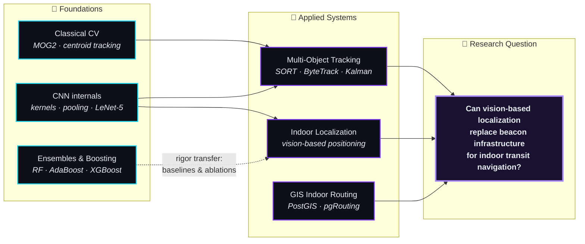

<div align="center">



<br/>

<a href="https://github.com/FirstKhoi">
  
</a>

<br/><br/>


<a href="https://github.com/FirstKhoi?tab=followers"></a>
<a href="https://www.linkedin.com/in/luong-nhat-khoi/"></a>
<a href="mailto:luongnhatkhoi2803@gmail.com"></a>

</div>

---

## `⚡ whoami`

```python
from dataclasses import dataclass, field


@dataclass(frozen=True)
class FirstKhoi:
    """Baselines before benchmarks. Ablations before claims."""

    name:   str = "Luong Nhat Khoi"
    handle: str = "FirstKhoi"
    origin: str = "Vietnam 🇻🇳"
    status: str = "CS / Data Science · undergraduate"

    goal:   str = "Research-grade computer vision, built from first principles."

    focus: list[str] = field(default_factory=lambda: [
        "Computer Vision  → detection, tracking, spatial reasoning",
        "Deep Learning    → CNN internals, optimization, ablations",
        "Classical ML     → boosting theory, interpretability",
        "Research craft   → baselines, ablations, reproducibility",
    ])

    principle: str = "Depth over breadth. One question, answered properly."

    def why(self) -> str:
        return "A result I cannot reproduce is a result I do not have."
```

---

## `🧭 research_map`

> How the pieces connect. Every branch is built to converge on one research question.



---

## `🛠 tech_stack`

<div align="center">

**Core**


**Data · Infra · Tooling**


</div>

<table align="center">
<tr>
<td valign="top" width="33%" align="center">

**Vision**

`OpenCV` `YOLOv8` `MOG2`
`Optical Flow` `Centroid`
`SORT` `Kalman Filter`

</td>
<td valign="top" width="33%" align="center">

**Learning**

`PyTorch` `CUDA` `CNN`
`LeNet` `ResNet` `XGBoost`
`LightGBM` `TreeSHAP` `AdaBoost`

</td>
<td valign="top" width="33%" align="center">

**Spatial**

`PostGIS` `pgRouting` `QGIS`
`GeoJSON` `Graph routing`
`EPSG:4326` `EPSG:32648`

</td>
</tr>
</table>

---

## `📦 featured_work`

<table>
<tr>
<td width="50%" valign="top">

### 🎥 Motion Detection → MOT
`OpenCV` `YOLOv8` `Kalman`

Classical CV pipeline with a **validated design decision**: MOG2 chosen over static background subtraction after empirical comparison — *2 correct tracks vs. 4 ghost tracks*.

Ships with CLI config, centroid tracker, and a YOLOv8 benchmarking harness.

`▸ next:` full MOT stack + MOTA/IDF1 eval

</td>
<td width="50%" valign="top">

### 🗺 Indoor Navigation (Thesis)
`PostGIS` `pgRouting` `GeoJSON`

GIS-based indoor routing for a metro station — pilot site **Ga Bến Thành**. Floor-plan graph extraction, multi-level pathfinding, and turn-by-turn guidance.

4-person group thesis, spatial DB stack under evaluation.

`▸ next:` CAD ingestion + routing benchmarks

</td>
</tr>
<tr>
<td width="50%" valign="top">

### 🧠 CNN From First Principles
`PyTorch` `NumPy`

Not a tutorial rerun — kernels, receptive fields and pooling derived by hand, then implemented. LeNet-5 reproduced, debugged, and ablated.

`▸ next:` CIFAR-10 ablation study (aug × depth × norm)

</td>
<td width="50%" valign="top">

### 🌲 XGBoost From Scratch
`NumPy` `scikit-learn`

Second-order boosting implemented from the math up — Newton step, Tikhonov-regularized leaf weights, exact split finding.

Benchmarked against a real tabular pipeline.

`▸ next:` parity check vs. `xgboost` reference

</td>
</tr>
</table>

---

## `📈 current_training_run`

```console
$ python -m notworle.train --track research-portfolio --epochs inf

  epoch  track                 metric              status
  ─────  ────────────────────  ──────────────────  ──────────────────────────
   01    classical-cv          ghost_tracks 4→2    ✔ MOG2 validated
   02    cnn-foundations       lenet5 debugged     ✔ forward() bug fixed
   03    ensembles             rf · adaboost       ✔ derived by hand
   04    boosting-theory       xgboost newton      ▶ in progress
   05    cnn-ablation          mnist → cifar10     ▶ in progress
   06    indoor-localization   leakage-safe split  ○ queued
   07    mot-benchmark         mota · idf1         ○ queued
   08    paper-reproduction    cvpr / iccv         ○ queued

  early_stopping = None          # patience: unlimited
  ⚠  watchlist: frame-level data leakage in video splits
```

<details>
<summary><b>📚 paper_trail</b> — what I'm reading and why <i>(click to expand)</i></summary>

<br/>

| Paper | Why it's on the list |
|---|---|
| **Simple Online and Realtime Tracking** (SORT) | Minimal, honest baseline — the thing every MOT claim should be measured against |
| **ByteTrack** | Shows how much performance lives in low-confidence detections |
| **Gradient Boosting: A Statistical View** (Friedman) | Boosting as functional gradient descent — the idea that makes XGBoost obvious |
| **XGBoost: A Scalable Tree Boosting System** | Second-order approximation + regularization; the bridge to optimization theory |
| **Batch Normalization** / **Deep Residual Learning** | Why depth became trainable — required context for any CNN ablation |
| **PoseNet / camera relocalization line of work** | Direct ancestry for vision-based indoor localization |

**Reading protocol:** *claim → experiment → does the ablation actually support the claim?*

</details>

---

## `📡 live_signal`

> Not narrative — pulled straight from the GitHub API on a schedule. If this block is stale, the pipeline broke, not the story.

<!-- LIVE_SIGNAL:START -->
```console
$ python -m notworle.stats --source github --live

  metric                        value       updated (UTC)
  ─────────────────────────────  ──────────  ────────────────────
  current_streak_days             3           2026-09-15 16:45
  contributions_this_week         18
  repos_touched_7d                4
  last_active_at                  2026-09-15

  source: github graphql api · auto-regenerated every 12h
```
<!-- LIVE_SIGNAL:END -->

---

## `📊 stats`

<div align="center">


<br/>


</div>

---

## `🐍 contribution_graph`

<div align="center">

<picture>
  <source media="(prefers-color-scheme: dark)" srcset="https://raw.githubusercontent.com/FirstKhoi/FirstKhoi/output/github-snake-dark.svg" />
  <source media="(prefers-color-scheme: light)" srcset="https://raw.githubusercontent.com/FirstKhoi/FirstKhoi/output/github-snake.svg" />
  
</picture>

</div>

---

## `🧊 isocalendar_3d`

<div align="center">


</div>

---

<div align="center">

```text
                    >>> FirstKhoi().why()
                    'A result I cannot reproduce is a result I do not have.'
```


</div>
